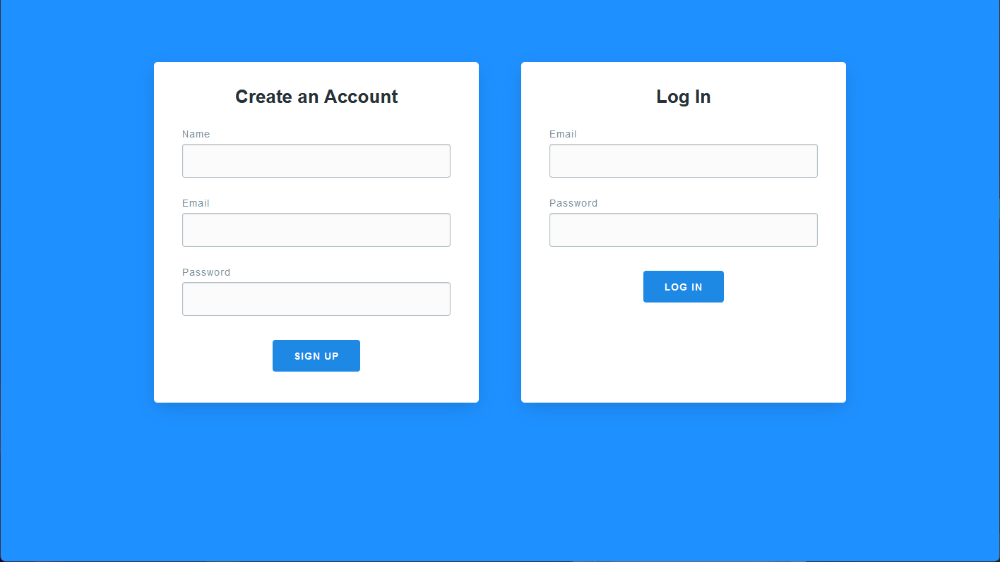
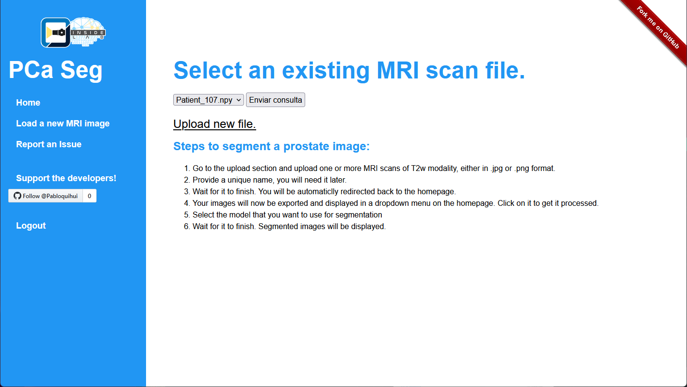
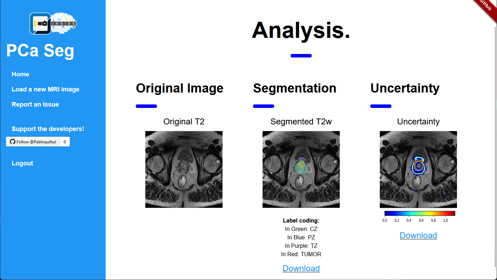

# Prostate Cancer Segmentation and Uncertainty Quantification

This work is a Webpage Flask app created for demonstration of the implementation of automatic segmentation deep learning model in real MRI biomedical images of the prostate and quantify the uncertainty of the prediction. 
This is part of my thesis project of Automatic Prostate Cancer Segmentation using Deep Learning models and aims to provide easier access to doctors and experts to try differents deep learning trained models.

## Preview




## Installation and Usage

1. Clone this repository
   ```bash
   git clone https://github.com/pabloquihui/PCa_WebPage.git
   ```

   or [Download](https://github.com/pabloquihui/PCa_WebPage/archive/refs/heads/main.zip) and then extract its contents.

2. Load a pretrained model inside the folder: `app/static/models/`. The name of the files should be `Model.h5` and `Model.json`. Or you can use the model that is already there (Attention Dense U-Net)
   It is important that if you use your own model, in order to correctly calculate the uncertainty, it should have [MonteCarlo Dropouts](https://towardsdatascience.com/monte-carlo-dropout-7fd52f8b6571) in it.

3. From the root folder of te repository, run:
```bash
pip install -r requirements.txt
```
to install all the dependencies. 

4. Start the app using following command, when in the main folder:

   ```bash
   flask run
   ```

   It may take a while. 

5. Now open your browser and navigate to http://localhost:5000 and follow the instructions. First, you need to create an account to have access to the files. It is recommended to have a Nvidia GPU, since it can speed up the prediction task manifolds.

## Sample MRI scans

There are 2 sample images from a private Dataset provided the `samples/` directory. You can use them to quickly test the app. Inside the same folder, with the name of 'patient_XX_GT.png' are the ground truth of the samples for comparison.

# Results

The results are shown after you load and submit a prostate image from the dropout list in the 'Home' tab. At the left is the original image, at the center is the predicted segmentation of that image, and at the right is the uncertainty that the model had in certain pixels.
If you want to change the number of predictions to calculate the uncertainty, inside the 'config.py' file is under the variable 'T'. Be aware that higher the number, more resources it will need. 

Below is an example of a prediction: 


